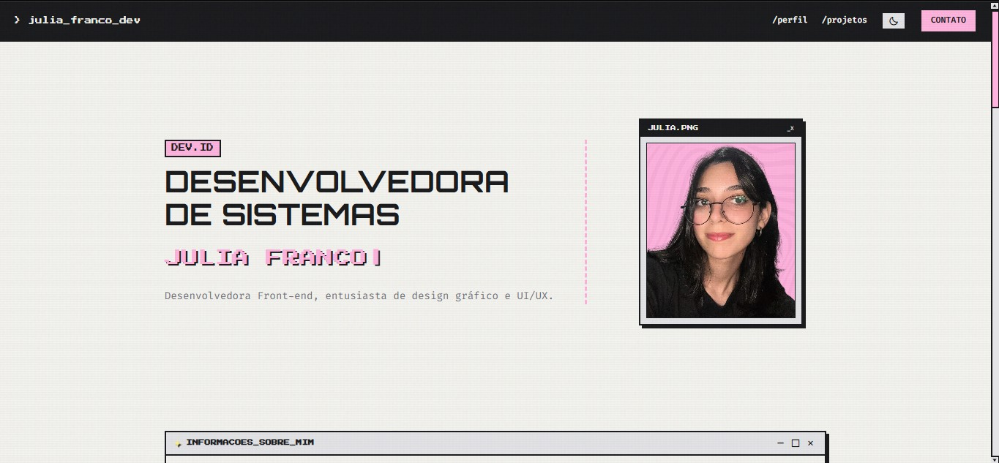
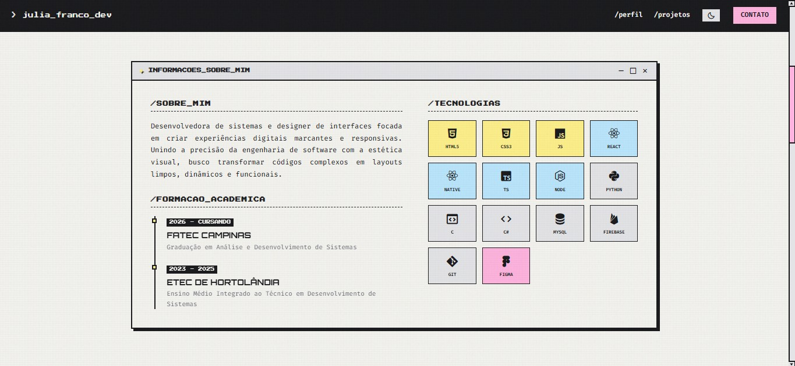
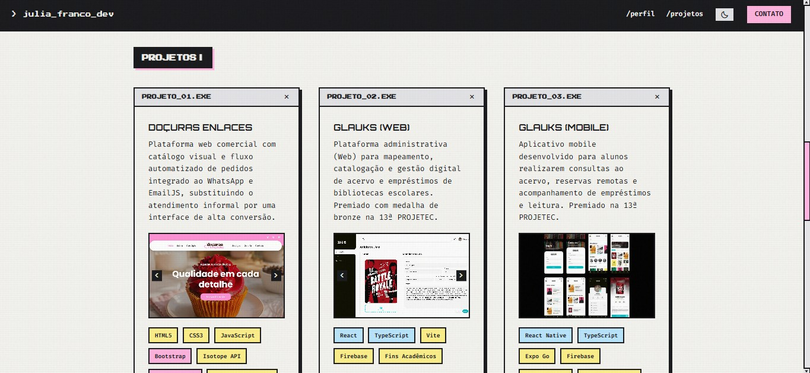

# ✦ `Portfólio Pessoal`


> Este é um projeto de portfólio pessoal interativo. A aplicação centraliza meus projetos comerciais e acadêmicos, atuando como um laboratório contínuo de experimentação em engenharia de software frontend, UI/UX, arquitetura estática e otimização de performance.

A plataforma substitui o formato tradicional de currículo por uma experiência interativa e imersiva baseada em janelas e terminais virtuais. Desenvolvida focando em identidade visual marcante e modularidade estrutural, a aplicação expõe minhas competências técnicas através de um ecossistema frontend limpo, performático, totalmente responsivo e hospedado de forma estática.

---

## 💡 `Sobre a Plataforma`

A arquitetura do projeto foi projetada para unificar uma estética retrô marcante com práticas modernas de desenvolvimento de interfaces. O sistema foi estruturado para mitigar gargalos comuns de layouts complexos através de:

* **Estilização:** Interface construída com sombras rígidas de alto contraste, bordas em bloco bem marcadas e tipografia pixelada.
* **Motor de Texturização Dupla:** Aplicação de ruído procedural via SVG filtrado em tempo real (`feTurbulence`) combinado a gradientes estáticos, simulando telas de monitores de tubo (CRT) e fibras de papel sem sobrecarregar o hardware do cliente.
* **Mecanismo de Escopo Isolado:** Arquitetura CSS limpa e reestruturada logicamente, prevenindo vazamentos de escopo em regras de responsividade (`@media queries`) e garantindo consistência visual estrita entre desktop e mobile.
* **Persistência de Estados:** Sistema nativo de alternância de temas (Modo Claro/Escuro) via JavaScript com adaptação dinâmica de variáveis CSS (`:root` e `[data-theme="dark"]`) para inversão instantânea de contraste.

---

## 💻 `Telas Principais`

| Tela de Apresentação | Tela Sobre |
| :---: | :---: |
|  |  | 
| Tela de Projetos | Tela de Contato |
|  |  | 

---

## 🛠️ `Tecnologias e Conceitos Aplicados`

| Segmento | Stack Tecnológica | Bibliotecas, APIs e Conceitos |
| :--- | :--- | :--- |
| **Interface & Core** | HTML5 Semântico, CSS3 (Variáveis Dinâmicas) | Arquitetura de Grades (CSS Grid), Flexbox, Layout Responsivo, Tipografia Fluída |
| **Lógica & Estados** | JavaScript Assíncrono (ES6+, Fetch API) | Manipulação Condicional do DOM, Persistência no LocalStorage, Manipuladores de Eventos, AJAX |
| **Estética & UI** | SVG Noise Filter, Animações em Passos | Boxicons API, Google Fonts (Press Start 2P, Orbitron, Fira Code) |
| **Deploy & Infra** | Git, GitHub Pages | Hospedagem Estática de Alta Disponibilidade, Otimização de Ativos |

---

## 📁 `Estrutura do Repositório`

```text
portfolio/
├── static/
│   ├── css/
│   │   └── style.css          # Estilização global, variáveis brutalistas, texturização CRT e responsividade
│   ├── img/                   # Ativos de identidade visual, capturas de tela e imagens otimizadas
│   └── js/
│       ├── main.js            # Inicialização geral, persistência de temas, relógio em tempo real e envio assíncrono do formulário
│       └── projetos.js        # Banco de dados estático e motor de injeção dinâmica do catálogo de projetos
├── .gitignore                 # Filtros de arquivos locais para isolamento do ambiente Git
├── contato.html               # Terminal de comunicação e conexões de e-mail externas 
├── index.html                 # Painel principal do sistema
└── README.md                  # Documentação técnica da plataforma